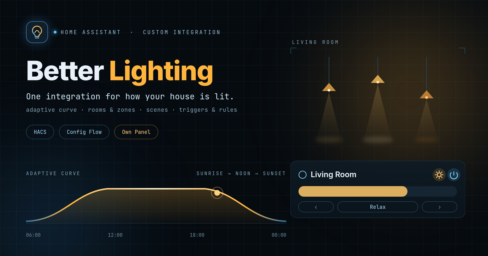

# Better Lighting



A Home Assistant integration that makes a light switch do the obvious thing.

Press it once and the room comes on in **adaptive mode** — brightness and colour temperature
following the sun. Press it again and it moves to the next scene in *that switch's* list.
Keep pressing and it comes back round to adaptive. The switch by the oven can reach *Cooking*
first while the one by the door does something else entirely.

Meanwhile: an automation can put the whole house into movie night and have it come back
correctly afterwards, presence sensors light rooms only when the blinds are down, an open
window switches to a deep amber that attracts fewer insects, and a bulb that reads dim can be
trimmed to match its neighbours.

It replaces the combination of [adaptive-lighting], [relative-light-group] and [scenery]
plus the automations needed to make them cooperate — and adds the things none of them can
express.

[adaptive-lighting]: https://github.com/basnijholt/adaptive-lighting
[relative-light-group]: https://github.com/Cheerpipe/relative-light-group
[scenery]: https://github.com/j9brown/scenery
[presence-simulation]: https://github.com/slashback100/presence_simulation

> **Status: beta.** Everything described here is implemented, tested, and running on a live
> Home Assistant instance. Expect rough edges, and please open an issue if you find one.

---

## Installation

### HACS

[](https://my.home-assistant.io/redirect/hacs_repository/?owner=Sweezy98&repository=ha-better-lighting&category=integration)

The badge opens this repository in your own Home Assistant, ready to install. Then restart, and:

[](https://my.home-assistant.io/redirect/config_flow_start/?domain=better_lighting)

By hand, if you would rather:

1. HACS → three-dot menu → **Custom repositories**
2. Add `https://github.com/Sweezy98/ha-better-lighting`, category **Integration**
3. Install **Better Lighting**, then restart Home Assistant
4. **Settings → Devices & Services → Add Integration → Better Lighting**

### Manually

Copy `custom_components/better_lighting` into your `config/custom_components/` directory and
restart.

**Requires Home Assistant 2026.1 or newer.** See [Supported versions](#supported-versions).

---

## Getting started

Adding the integration creates one **Better Lighting** entry that holds everything else. The
first screen asks for house-wide defaults — how bright and how warm your lights should be at
either end of the day. Sensible values are pre-filled; you can change them later.

Then, from the integration's page, add the pieces you need:

1. **A room** — pick its lights. This is the only step you actually need. You get a
   `light.<room>` entity that follows the sun straight away.
2. **A scene or two** — *Cooking*, *Movie night*, *Reading*. Scenes are house-wide recipes,
   not per-room.
3. **A switch** — if you want a specific cycle order, or two switches in one room behaving
   differently.

A room with no switch configured still cycles: a plain `light.turn_on` on its light entity
walks through adaptive and then every scene, so a dumb wall switch works with no extra setup.

---

## What you configure

There are only two things to add to the hub — a **room** and a **mode** — because everything
else belongs to a room and is configured inside it.

| Object | What it is |
|---|---|
| **Room** | One room's lights, controlled together. Creates a `light`, a scene `select`, switches for adaptive and night, and buttons. Holds this room's scenes, switches and light calibration. |
| **Mode** | A cross-room mode such as Home Cinema: named states, and what each room does in each. |

Inside a room:

| Inside a room | What it is |
|---|---|
| **Scene** | A list of this room's lights and what each should look like — brightness, colour, off, or left alone. Nothing is house-wide: a reading scene for the living room and one for the bedroom are different lists of different lights. Build one by hand, or **capture the room as it is now**. |
| **Light switch** | A switch on this room's wall, with its own ordered list of this room's scenes. Understands rockers: the lower half gets its own actions, and holding either end dims or brightens. |
| **Light calibration** | Per-light minimum, maximum and offsets, to match a mismatched bulb to its neighbours. |
| **Triggers** | The sensors that ask for this room's lights — motion, a door, a cover. Any one of them is enough. |
| **Rules** | What has to hold before a trigger may fire — after dark, dark enough, not on holiday. All of them have to hold. |
| **Presence simulation** | What this room does while the house is empty: replay last week, light adaptively, show a scene, or sit it out. |
| **Light group** | Several of this room's lights under one name — the three bulbs in one fitting, a row of ceiling spots. Given a Zigbee group entity, the whole group changes in one command instead of arriving one bulb at a time. Groups can hold groups, so a 3×3 of spots is three rows. |
| **Zone** | A part of this room that may be told something different — the couch and the desk of one living room. A zone follows its room until it has a reason not to. |

In the global config:

| Global | What it is |
|---|---|
| **Colour presets** | The house's named colours — "TV orange", "candle" — so a colour used in several scenes is described once and picked by name. |
| **Night mode helper** | The one helper that says the house is asleep. Each room decides for itself whether that dims it, darkens it, applies a scene, or does nothing. |

### Zones: the desk that does not go dark for the film

A living room is one room and several places. The couch and the desk are lit
together, switched together and adapt together — which is what makes them one
room — but a desk somebody is working at should not be darkened because the rest
of the room is watching a film.

So a zone **follows its room until it has a reason not to**, and rejoining is the
default:

- Give the zone an occupancy sensor and turn on *step out of a house mode while
  occupied*. While somebody is there **and** a cross-room mode is driving the
  room, that zone carries on by itself — its own scene if it names one, and
  otherwise simply the lights, adaptively. A desk already occupied when the film
  starts is never darkened in the first place.
- When the sensor has been clear for the zone's delay, it rejoins the room and
  goes back to whatever the room is being told. Nothing has to be put back by
  hand.
- A **switch can name a zone**, and then it drives only that zone: the desk's
  switch lights the desk and leaves the couch alone. Stepping that switch back
  to adaptive puts the zone back in the room.
- A zone can answer for **its own adaptive curve** — brighter and cooler than the
  room it sits in. That is one more layer of the same kind: hub, then room, then
  the part of the room.

Occupancy on its own detaches nothing: with no mode driving the room, a busy desk
is the room's own business, which is what the room's presence settings are for.
A light may be in at most one zone, for the same reason it is in at most one
room, and saving is refused if two zones claim the same bulb.

### The dashboard card

The integration ships a card, loaded for you — there is no Lovelace resource to
add. Pick **Better Lighting room** in the card picker and choose a room's light.

One row of controls each, and nothing that gets used twice a year:

- **The title** opens Home Assistant's own light dialog, which is where colour
  and temperature live. They are not worth two buttons on every room.
- **Badges** say *why* the room looks the way it does: somebody is here, and
  whether the lights are on by hand or by a trigger.
- **Back to adaptive** appears only when the room is *not* adaptive. It is the
  way back after a scene or a manual change, not a toggle — there is no such
  thing as turning adaptive off from a card.
- **Power** and a **brightness slider**, which moves the room the way the room is
  configured to move: members keep their own headroom.
- **Scenes** as previous, a dropdown, and next.

```yaml
type: custom:better-lighting-card
entity: light.living_room
```

### Motion and door sensors

Every room and every zone has its own **Triggers** and its own **Rules**, set
where you are already looking at that room.

**Triggers** are the sensors that ask for the lights. A drive has motion, a
garage has a door, a porch may have both — so they are **ORed**:

- **While any trigger is active**, the lights stay on.
- **When the last one clears**, they go off after the delay you set. A fresh
  trigger during that wait starts the wait again.
- **If somebody reached for the switch** — before a sensor ever fired or half way
  through the wait — the clock stops. The lights stay on until they are turned
  off by hand, and then the automation has them back. Turn *Hold when set by
  hand* off if you would rather the timer always won.

"Active" needs no configuring for the usual sensors: `on`, `open`, `home` and
`detected` all count, so a binary sensor, a cover and a device tracker are each a
trigger as they are. Name a state outright for anything that reports something
else.

A whole room lights from its triggers through its **Presence** settings; a zone
does it with *Light this zone while the sensor is active*, which is how one
motion sensor lights the drive without touching the rest of the outside.

**Rules** decide whether a trigger may fire, and belong to the same room or zone:

| Rule | Checks |
|---|---|
| Between two times | The local clock. An end earlier than the start runs through midnight, so 22:00 until 06:00 is one night. |
| A number below / above a threshold | A lux sensor, a temperature, anything numeric. |
| An entity in a particular state | A helper that arms the automation, a presence toggle that disarms it, or `sun.sun` being `below_horizon` — which is "after dark" without owning a lux sensor. |

They are **ANDed**: every rule has to hold, so adding one can only ever make an
automation fire less often, never more — which is the opposite of triggers, where
one more can only make it fire more. A rule whose sensor cannot be read blocks by
default — "allowed only if every rule passes", and a rule nobody can evaluate has
not passed — and each rule can be told to let it through instead, for a flaky
sensor that should not leave somebody on an unlit path.

### Presence simulation

While the house is empty, make it look lived in. Point the integration at **one
helper that says nobody is home** — deliberately not worked out from device
trackers, because a guest nobody tracks is still somebody at home, and
simulating over their head is the one failure here that actually matters. An
unreadable helper counts as *not* empty.

Each room chooses what it does:

| Mode | What happens |
|---|---|
| **Replay what it actually did** | The same weekday, a week ago, from the recorder — shifted. This is the convincing one. |
| **Light it adaptively** | Steady, and obviously so. |
| **Show a scene** | One fixed look. |
| *(taking part turned off)* | Nothing. A bathroom nobody can see from the street proves nothing. |

Replay matters more than it sounds. A hall light that comes on at 19:03:12 every
single evening is advertising an empty house rather than hiding one — so **each
step moves by its own random amount**, up to the jitter you set. Shifting the
whole evening by the same twelve minutes would still be exactly last week.
Order survives the shuffle: a light still comes on before it goes off. Only
*which rooms were lit when* is replayed; brightness comes from the room's own
curve, which knows what nine in the evening should look like better than last
Tuesday does.

**Rules** gate the whole thing, the same rules a trigger uses — a time window,
a lux threshold, a holiday helper. `switch.better_lighting_presence_simulation`
shows whether one is running and which rooms are in it, and turning it on runs
one regardless of the rules, which is how you check the setup without waiting
for nightfall.

It stops the instant the helper says somebody is back — not at the end of the
timeline — and every room it lit goes off again, unless somebody reached for a
switch on their way in.

Replay needs the `recorder`. Without it that mode finds nothing to play and
leaves the room dark, which is a better impression of an empty house than
lighting it all evening.

### Light groups: three bulbs, told once

Three smart bulbs in one fitting should change together. Asking Home Assistant
to set three entities sends three Zigbee commands and you can watch them arrive;
a Zigbee group entity is one multicast. Name the group, point it at that entity,
and the group is used whenever every member is being told the same thing — and
abandoned the moment one differs, so a scene with one red, one green and one blue
bulb still addresses them individually.

Groups can contain groups. A 3×3 of ceiling spots is three rows of three, and a
scene can set the whole ceiling amber and the middle row dim in two lines rather
than nine. A light's own entry beats every group holding it. A group cannot
contain itself, directly or through another, and saving one that does is refused
with the loop named.

### One light, one room

A light may belong to **exactly one room**, and the configuration screen enforces it. That is
what keeps manual changes, scene control and switch presses unambiguous — the integration
always knows who owns a given bulb.

---

## The wall switch

A press turns the room on in adaptive mode; each further press moves along that switch's list,
wrapping back to adaptive. Three ways a press can reach the integration, and they work
together:

| How | Use it for | Can it tell switches apart? |
|---|---|---|
| **Watch an entity** | Zigbee/Z-Wave buttons (`event`, `sensor`, `binary_sensor`) | **Yes** — needed for per-switch orders |
| **`better_lighting.press`** | Automations, Node-RED, device triggers | Yes, by name |
| **Plain `light.turn_on`** on the room's light | A dumb wall switch, no configuration | No — Home Assistant only sees a service call |

A press that interrupts something automatic — a manual change, an insect scene, a film in
progress — lands on **adaptive without advancing**. The next press then cycles normally. So
grabbing the switch always gets you back to normal light in one press, whatever the house was
doing.

Quick taps are counted rather than queued or dropped: three taps move three places in one go,
without flashing through the two in between.

---

## The panel

Better Lighting adds a **Better Lighting** page to the sidebar, and **everything
is configurable from it** — rooms and all their settings, scenes, switches,
light calibration, cross-room modes and the global defaults. The settings
screens under *Devices & services* still work and do the same things; use
whichever you prefer.

The panel renders its forms from the same field tables the settings screens
render, so the two cannot disagree about what a setting is, and a new setting
appears in both at once. Each field is drawn by **Home Assistant's own
controls** — its entity and icon pickers, its toggles, its dropdowns — so the
page behaves like the rest of Home Assistant rather than like an imitation of
it.

### Importing Home Assistant's scenes

Already have scenes in Home Assistant? The panel can bring them across.
**Import from Home Assistant** on a room's Scenes screen lists them, showing
how each one falls across your rooms.

A scene there can cover the whole house; here a scene belongs to exactly one
room. So one that touches the lounge and the kitchen becomes **two scenes, one
in each**, holding only that room's lights — tick the rooms you want. Lights in
no room of yours, and anything that is not a light, are named rather than
dropped quietly.

### The scene editor

Built in the shape of Home Assistant's own scene editor, with two modes:

- **Live mode** puts the scene on the actual bulbs, and clicking a light opens
  **Home Assistant's own light dialog** — its colour wheel, its brightness and
  temperature sliders, its favourite colours. The controls are the ones you
  already know, because they *are* the ones you already know. Saving reads the
  lights back, so a scene cannot disagree with what you were looking at.
- **Review mode** touches nothing: add and remove lights and set how each is
  treated, without the room changing around you.

Each light in a scene takes the scene, is **switched off**, or is **left alone**
— and its colour can **follow the sun** while it takes the scene's brightness.
Leaving live mode puts the room back; nothing is stored until you press Save.

In the scene editor, pick a room, pick a scene or start a new one, and set each light: a brightness,
a colour, *leave the colour to the sun*, off, or left alone entirely. **Capture
from the room** fills the whole scene in from what the room is doing right now,
which is usually faster than setting anything by hand.

Navigation is a room at a time: pick a room and its sections appear beneath it
— lights, group behaviour, adaptive, night, power cycle, presence, open
windows — followed by its scenes, switches and calibration. Modes, the colour
presets, the global settings and the diagnostics page sit below the rooms, and
a breadcrumb above the content says where you are with one way back.

---

## Scenes

Scenes belong to a room. You will find them under that room in **Settings → Devices &
services → Better Lighting**, alongside its switches and its light calibration — so the hub
page lists your rooms rather than one long list of everything.

**A scene only ever affects the room it belongs to.** Selecting *Reading* in the living room
changes the living room and nothing else. Two rooms can each have a *Reading* scene; they are
different lists of different lights and there is no need to name them apart.

If you want several rooms to change *at the same time* — everything dimming when a film starts
— that is what a [cross-room mode](#cross-room-modes-home-cinema) is for.

### What a scene is made of

A scene is a list of lights and what each one should look like. There is no house-wide
brightness or colour, which is what makes a film scene expressible at all:

| Light | What you set |
|---|---|
| Strip behind the TV | 7%, a deliberate orange |
| Strip on the floor | 16%, a slightly warmer orange to sit against the wood |
| Ceiling light | *Switch it off* |
| Desk lamp | 20%, **leave the colour to the sun** |
| All lights in this room | a fallback for anything not named above |

Four things make that work:

- **Whatever a light does not name keeps following the sun.** Give a light a brightness and no
  colour and its colour goes on adapting through the evening; give it a colour and no
  brightness and the reverse. This is per light, so one scene can pin the ceiling while the
  desk lamp keeps warming.
- **All lights in this room** is a single entry covering everything you have not named, so the
  simple case stays one row rather than one per bulb.
- **Switch it off** darkens one light while the rest of the room stays lit — distinct from
  **Leave it exactly as it is**, which does not touch it at all.
- **Capture the room as it is now** builds the whole list from what the room is doing this
  second. Set the room up with Home Assistant's normal light controls, then name it.

### Building one

Use [the scene editor](#the-panel) in the sidebar: it has the colour wheel and shows
the room changing as you work. The settings screens can do the same job without the wheel —
there, capture the room as it stands, or define a **colour preset** in the global config and
pick it by name.

#### RGBWW strips

Choosing **Colour picker plus white channels** sends all five channels an RGBWW fixture has.
Leave both white sliders at zero and you get a pure colour from the RGB LEDs, with the white
ones off — genuinely that orange, rather than a white-washed approximation of it. Raise the
warm channel to take the edge off a strip sitting against a wooden floor.

Give a plain RGB value to an RGBWW fixture and the white channels are set to zero for you.
Give one to a colour-temperature-only bulb and it keeps its adaptive white instead, since a
projection of saturated orange onto white is nobody's idea of the scene.

Other options worth knowing:

- **Only affect lights that are already on** — adjust a room without lighting it up.
- **Lights this scene says nothing about** — keep adapting (the default), switch off, or leave
  alone.
- **Ignore presence sensors while active** — for a film in the living room.

---

## Light switches

A switch belongs to the room it drives, and cycles that room's scenes. Adaptive is always the
first step, so a press on a dark room lights it adaptively and each further press moves one
place down the list before wrapping back.

A new switch cycles every scene in its room, and a scene added later joins the end of every
switch's list. **Scenes it cycles** on the switch's own screen reorders that list and takes
scenes out of it; anything taken out stays out, including when the room gains a scene
afterwards.

**Adaptive is an entry in that list**, not a setting about it — so it can sit between two
scenes, or be taken out entirely for a switch that does one thing and nothing else, like a
reading light. A list always holds at least one entry: removing the last scene leaves adaptive,
which every room can offer.

Two-button switches are understood. The lower half gets its own words and its own actions, so
the usual arrangement works out of the box:

| Gesture | Default |
|---|---|
| Up | on, then cycle |
| Down | switch the room off |
| Hold up | brighten |
| Hold down | dim |
| Double press, either half | configurable |

A press is acted on the moment it arrives, so three quick taps move three places, one at a
time.

Not every button reports what it did, though, and two settings cover the ones that do not.
**Two presses count as a double** is for a button with no double press of its own, which sends
the same single press twice and leaves the pairing to whoever is listening; the window decides
how quick is quick enough, and each half of a rocker answers for itself. Those taps are the one
thing that cannot be acted on at once, since until the window closes nobody knows what the
gesture was.

**Any change counts as a press** is for a switch whose words this integration has none of — a
toggle alternating on and off, most often, which could otherwise only light the room and darken
it again rather than cycle. Everything it sends then cycles the room, so switching off needs a
place in the cycle or another switch.

When a switch does nothing, the panel's diagnostics page shows what it published and what each
value was read as; anything read as *nothing* is a word it has not been told about.

Holding keeps going. Almost every button reports being held once and then says nothing until it
is let go, so a hold that moved the room one step and stopped would be a press with a long name;
instead the room keeps moving, one step every 400 ms by default, until the button reports being
released — about four seconds for a full sweep. A button that never reports letting go stops
after ten seconds.

Holding to dim shifts the whole room by a **bias** rather than fixing a brightness, so a room
held down two steps keeps tracking the sun all evening — two steps below where it would
otherwise be. Holding the dimmer in a dark room sets where it will come back on rather than
lighting it.

An action that names no room at all is about the house rather than any one part of it: it runs its
scripts and nothing else, which is what a projector or an amplifier wants.

An action can also **run scripts**. A film is not only a lighting change — the amplifier, the
blinds, a notification — and an action already knows when the mode reaches a state, so it is the
right place to say what else happens. The scripts run once per action however many rooms it
covers.

One of the states an action can name is **off**, which is the mode ending. Its scripts run then —
including when the mode is switched off part-way through a film, which is also when the rooms
go back to how they were.

Night mode can also be **asked again**. The house goes to bed, the rooms that should go dark go
dark, and then somebody gets up for a glass of water and leaves a light on. Reaching for the
night switch does nothing, because night mode never stopped being on — so there is a button
(`Night: lights off`) and a service (`better_lighting.night_lights_off`) that repeat what
happened when the house went to bed. Only while night mode is on, and down the same path as the
original, so a room somebody is standing in is still left alone.

---

## Effects and notifications

An effect is a **shape** rather than a value: breathe, flash, pulse, flicker like a candle. It
says nothing about which colour or how bright — it says what to do with whichever it is handed,
so one "breathe" is the breathing for a bright red alarm and for a dim amber reminder alike.
Five ship with the integration; more can be written in the panel as a list of steps, each a
share of the brightness it is given, a time to get there and a time to stay.

**Notifications** say something with a room's lights and then put them back:

```yaml
action: better_lighting.notify
data:
  room: kitchen
  effect: flash
  rgb_color: [0, 255, 0]
  duration: 2
```

Green for two seconds when the washing is done; amber breathing when a door was left open; red
when it matters. Afterwards the room resumes whatever it was doing — and **lights that were off
go back off**, which is the whole reason it remembers. Name `lights:` to use only some of the
room's.

`better_lighting.apply_effect` plays one until something stops it — a candle for the evening —
and `better_lighting.stop_effect` ends it and puts the room back. A **scene can carry an
effect** too, and plays it for as long as the scene is showing.

The panel lists every effect, the five built-in ones included; any of them can be copied into
one of your own and edited step by step, and tried on a room from the same page.

---

## Adaptive lighting

**Which lights adapt is the room's to say.** By default it is all of them — pressing the switch
lights the room. A room with decorative lighting can name the lights that follow the sun and
leave the rest for a scene to ask for by name, so the thing on the shelf does not come on with
the ceiling.

Three layers, each optional:

1. **House defaults** — set once when you add the integration.
2. **Per-room overrides** — a room can define its own curve.
3. **Per-light calibration** — trim one bulb.

The first two define the *curve*: what "darkest" and "brightest" mean across the day. A light
calibration *clamps and adjusts* whatever the curve produced.

Within a calibration the order matters, and it is deliberate:

> **The offset is applied first, then the minimum and maximum.**

An offset says "this fixture reads dim". A limit says "never below 15%, it flickers". A
calibration must never be able to breach a limit you set, so the limit wins. One corollary
worth knowing: per-light limits are **absolute targets**, not shifts of the room's range. With
a room value of 15%, an offset of +10 and a minimum of 30, the result is 30% — not 25%.

Values that get clipped are reported in the room's diagnostics rather than silently swallowed.

Brightness and colour are **two separate switches** per room, because the axes are genuinely
independent: a room can keep warming through the evening while its brightness stays where you
put it, or hold a colour while still dimming with the day. Switching an axis off means "stop
following the sun" — a scene can still set that axis.

### Night mode

Night mode follows an **existing helper** — an `input_boolean`, a schedule, a sleep sensor —
rather than owning a schedule of its own, so the house keeps one source of truth for "we are
asleep". The helper is named **once, in the global config**: whether everyone is asleep is a
fact about the household, not about a room.

What each room does about it is per room, because a bedroom and a hallway should not react the
same way: dim and warm, apply a designated night scene, **switch off once the room is empty**,
or ignore night entirely.

Switching night mode on never lights a room that is dark. It adjusts the lights that are
already on and leaves the rest alone.

That last one waits: if somebody is still in the room when the house goes to bed, the light
stays exactly as it is and only goes out once they leave. Reaching for the switch meanwhile
cancels it — that is you saying you want the light.

The waiting only applies when the **helper** turns on, which is the house going to bed. The
room's own night switch always dims rather than darkens, because reaching for it is a person
asking for night light now.

---

## Presence and open windows

An optional occupancy sensor lights a room and darkens it again, but only when a configured
list of covers is **closed** — so a sunlit room is left alone. Closing a blind while somebody
is already in the room counts just as much as somebody walking into a dark one.

Presence can be silenced three ways, all meaning the same thing:

- **Night mode ignores presence** — for a bedroom.
- **A scene ignores presence** — for the living room during a film.
- **A room a cross-room mode is driving** follows that mode's actions instead.

It will also not switch off a room somebody has just set by hand.

An optional door or window sensor switches the room to a designated **insect scene** — usually
deep amber, which attracts far fewer insects than white light. It will not light a dark room,
it debounces a slamming window, and a switch press waves it away until the window is closed
and opened again.

---

## Cross-room modes: home cinema

A **mode** spans several rooms and has named states — *playing*, *paused*, *credits* — that an
automation moves between by setting one `select` entity. Each (state, room) pair has a rule:
apply a scene, switch the room off, return it to adaptive, or leave it alone.

Three behaviours make this feel right rather than merely functional:

- **An occupied room is not plunged into darkness.** The instruction waits until the room
  empties, and is re-checked when it fires — by then the film may have ended or been paused,
  or you may have taken the room back, and each of those cancels it.
- **The snapshot is taken once**, when the session starts, and survives every state change
  within it — including a Home Assistant restart.
- **On the way out, rooms return to adaptive, relighting only the lights that were on
  beforehand.** The snapshot says *which* lights; the sun says *how bright*.

Press a switch in a room during the film and that room is **yours** for the rest of the
session: later state changes skip it, and the ending leaves it as you left it. Use
`better_lighting.rejoin_mode` to hand it back.

### Switching a mode off

Each mode has an **Enabled** switch. Turn it off and the mode stops touching the rooms —
switching it off mid-film puts them back straight away — but it keeps listening, so the
select still shows what the player is doing. That is the point: your automation only fires on
*changes*, so a mode that had forgotten the film was playing would sit idle until the credits
rolled. Turn the switch back on halfway through and the rooms dim there and then, snapshotting
themselves as they are at that moment so the ending restores what you actually had.

### The blueprint

A ready-made automation ships with the integration:

[](https://my.home-assistant.io/redirect/blueprint_import/?blueprint_url=https%3A%2F%2Fgithub.com%2FSweezy98%2Fha-better-lighting%2Fblob%2Fmain%2Fblueprints%2Fautomation%2Fbetter_lighting_home_cinema.yaml)

Point it at your media player and your mode's *State* entity. Playback starts the mode,
pausing moves it to *paused*, and stopping ends the session after a short delay — so switching
episodes does not relight the whole house.

---

## Diagnostics

The panel has a **Diagnostics** page: what every room and mode currently
believes — its mode, its scene, which lights are under manual control, whether
night or insect mode is showing, which cross-room session owns it — beside a
live log of the events that got it there. A room's state tells you where it
ended up; the log tells you which press or which film put it there.

It is the same dump the diagnostics download produces, so what you read on the
page and what you attach to a bug report cannot disagree.

It also **draws the adaptive curve** for the selected room across today: a line
for brightness, a band behind it painted with the colour temperature at each
moment, and markers for sunrise, sunset and now. Underneath, what each light
would actually be sent this second — the curve after per-light offsets, clamps
and anything held manually. The curve is otherwise the least visible thing the
integration does; this turns "the evening feels too bright" into something you
can point at.

---

## Services

| Service | What it does |
|---|---|
| `better_lighting.press` | Act as though a switch was pressed. `kind` can be `press`, `double_press` or `long_press`. |
| `better_lighting.cycle` | Move a room along its cycle, `next` or `previous`. |
| `better_lighting.set_adaptive` | Force a room back to adaptive, clearing any scene or manual change. |
| `better_lighting.activate_scene` | Apply a scene to a room. |
| `better_lighting.clear_manual_override` | Hand lights back to the adaptive engine. |
| `better_lighting.set_mode` | Move a cross-room mode to one of its states. |
| `better_lighting.end_mode` | End a mode's session and put the rooms back. |
| `better_lighting.rejoin_mode` | Hand a room you took back to the mode again. |

Rooms can be targeted either by Home Assistant `target` (any of the room's entities) or by
naming the room in the `room` field. The second is stabler for automations, since it survives
renaming an entity.

---

## When something surprises you

**Download diagnostics** — Settings → Devices & Services → Better Lighting → the three-dot
menu. It includes not just your configuration but what the integration currently *believes*:
which lights it thinks you have taken over by hand, which calibrations are being clipped, and
what each mode session is waiting on. Those answer most "why is this light doing that?"
questions immediately.

**Repair issues** appear when configuration comes apart — a scene deleted while a switch still
cycles through it, a room deleted from under a mode's action, a light claimed by two rooms. Home
Assistant cannot prevent the deletion, so the integration skips the broken reference rather
than failing, and tells you instead of silently shortening your cycle.

**Events** trace every decision, if you want to watch in Developer Tools:
`better_lighting_press`, `better_lighting_zone_mode_changed`, `better_lighting_mode_changed`,
`better_lighting_zone_opted_out`, `better_lighting_deferred_action`. Rooms were once called
zones; the event names and their `zone_id` field keep that spelling so existing automations
go on working, and each payload now carries `room_id` beside it.

### A light is physically on but Home Assistant shows it off

Better Lighting only ever acts on what Home Assistant reports. If a bulb's state is stale,
this integration will skip it — a colour change reaches the lights Home Assistant believes
are on, so a bulb wrongly shown as off is left alone.

That is a Zigbee/Z-Wave state-reporting problem rather than a lighting one, and it is worth
fixing at the source, because every other integration is being misled in the same way. Things
worth checking:

- Watch the device in your Zigbee stack directly (Zigbee2MQTT's frontend, or the deCONZ app).
  If the state is wrong *there* too, Home Assistant is only reporting what it was told.
- A bulb on a mains switch that cuts power comes back on at its last setting, but only
  announces itself when it rejoins the network — which can take a while.
- Group or scene commands sent inside the Zigbee network often do not produce a per-bulb
  report, so bulbs changed that way can drift out of sync until something polls them.
- `homeassistant.update_entity` on a suspect light forces a refresh, which is a quick way to
  tell a reporting problem from a state-tracking one.

Common gotchas:

- **My lights stopped adapting.** Something was changed by hand, so the integration backed
  off. Press the switch, use the *Clear manual override* button, or wait for the timeout
  (90 minutes by default).
- **Presence does nothing.** Check the cover gate — by default *every* listed cover must be
  closed, and a cover Home Assistant cannot read counts as blocking.
- **A bulb drops its colour when brightness changes.** Some Tuya and older Zigbee bulbs do
  this. Turn on *Send brightness and colour separately* in the advanced settings.

---

## Supported versions

Home Assistant **2026.1 or newer**. This floor is verified rather than assumed — the full test
suite runs against each release below:

| Home Assistant | Result |
|---|---|
| 2026.9.2 | pass |
| 2026.6.4 | pass |
| 2026.3.4 | pass |
| 2026.2.3 | pass |
| 2026.1.3 | pass |
| 2025.12.5 and earlier | not supported |

Below 2026.1 the integration cannot currently be verified, for reasons that are not about this
code: 2025.12 and earlier ship a pytest whose assertion rewriting crashes on current Python
3.13 releases, and 2025.3 pins a yanked `aiohttp` so it will not install at all. Rather than
claim compatibility that has not been demonstrated, the floor is set where the evidence ends.

`scripts/probe_ha_floor.sh 2026.1.3 2026.9.2` re-runs the matrix.

---

## Development

The system Python on many distributions is too old for modern Home Assistant, and may lack
`venv`. [uv] handles both:

```bash
curl -LsSf https://astral.sh/uv/install.sh | sh
export PATH="$HOME/.local/bin:$PATH"
uv python install 3.14
uv venv --python 3.14 .venv
uv pip install homeassistant pytest-homeassistant-custom-component ruff
```

[uv]: https://docs.astral.sh/uv/

```bash
.venv/bin/python -m pytest tests/          # everything
.venv/bin/python -m pytest tests/pure/     # no event loop, milliseconds
.venv/bin/ruff check custom_components/ tests/
```

Tests are split deliberately:

- **`tests/pure/`** covers modules that import nothing from `homeassistant`. The calculation
  layer — sun curves, per-light calibration, the render pipeline, the cycling logic, the
  deferred-action rules — lives there, so its full behaviour matrix is testable without an
  event loop.
- **`tests/ha/`** covers the integration surface: flows, entities, services. It uses real
  member light entities and the real service path, so assertions are about what the bulbs
  actually did.

Note that `ruff`'s target is Python **3.13**, not 3.14, because Home Assistant 2026.1 and
2026.2 run on 3.13. Targeting the development Python once let 3.14-only syntax reach a release
that could not parse it.

## Translations

English and German ship with the integration. German is generated from the English
strings by `scripts/make_german.py`, which refuses to write anything unless every string is
covered — Home Assistant falls back to English per missing key, so a partial translation
produces a form that is half one language and half the other.

To add a language, copy the mapping in that script and translate the values. A test asserts
that each translation covers exactly the same keys as English and keeps every `{placeholder}`
intact.

## Standing on

Several integrations each solved a piece of this, and none of them talked to the others. This
one exists because of them, and parts of it are their work rather than mine.

| Project | What it does | What came from it |
|---|---|---|
| [adaptive-lighting] | Brightness and colour temperature from the sun's position | The sun and curve mathematics in `adaptive.py` is a port of its `color_and_brightness.py`, and its `tests/test_color_and_brightness.py` was repointed at ours. The `FieldSpec` table generalises its `VALIDATION_TUPLES` plus side-car `EXTRA_VALIDATION`. |
| [relative-light-group] | A light group that dims members relative to their own brightness | The headroom algorithm in `brightness.py`, and the decision to vendor a group base rather than subclass Home Assistant's non-public `LightGroup`. |
| [scenery] | Named colour and brightness presets, cycled by a select | The colour model and the tolerance-based state comparators in `scenes.py`, ported from its `light_utils.py`. |
| [presence-simulation] | Replays your lights from history while you are away | The reference for presence simulation: fetching significant states on the recorder's own executor, and filtering `unknown` and `unavailable` out of a recorded day before replaying it. |

Where this integration disagrees with them it is written down: per-`(room, light)` manual-override
tracking rather than a global dictionary keyed by light, zero-flash turn-on from a structural
invariant rather than by patching `hass.services`, and a room select whose value is derived from
state we own rather than guessed by matching light attributes.

Please check each project's own licence before reusing what came from it; this repository's
licence covers this repository's work.

## Licence

MIT. See [LICENSE](LICENSE).
